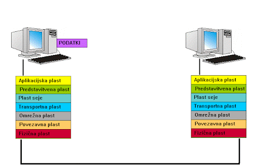

# Dokumentacija fizične plasti komunikacijskega sistema

**Predmet:** Sistemi daljinskega vodenja

**Avtorji:**
- Rok Merlak – rok.merlak@student.um.si
- Niko Korošec – niko.korosec@student.um.si
- Jakob Sadar – jakob.sadar@student.um.si

## 1. Uvod

<div align="justify">
V okviru naloge pri predmetu Sistemi daljinskega vodenja smo izdelali poenostavljen komunikacijski sistem za prenos sporočila preko fizične plasti. Namen naloge je bil prikazati celoten potek prenosa podatkov, od priprave sporočila na oddajni strani do sprejema, rekonstrukcije in preverjanja pravilnosti na sprejemni strani.

Najprej se besedilno sporočilo pretvori v bajte in vstavi v podatkovni okvir. Okvir vsebuje sinhronizacijska in naslovna polja, dolžino podatkovnega dela, uporabniške podatke ter CRC-32 kontrolno vsoto za zaznavanje napak. Nato se okvir pretvori v bitni tok, ta pa se dodatno zaščiti s Hammingovim kodiranjem. Kodirani biti se modulirajo z BPSK modulacijo, signalu pa se za simulacijo realnega kanala doda še šum.

Na sprejemni strani se najprej izvede sinhronizacija s Costasovo zanko, nato BPSK demodulacija in Hammingovo dekodiranje, s katerim lahko popravimo enobitne napake. Iz tako dobljenih podatkov se ponovno sestavi okvir, na koncu pa se s CRC-32 preveri, ali je bil prenos uspešen, in izlušči sprejeto sporočilo.
</div>

<p align="center">  </p>


## 2. Uporabljene metode

Pri implementaciji sistema smo uporabili več osnovnih metod s področja digitalnih komunikacij:

- **CRC-32** za zaznavanje napak
- **Hamming(7,4)** za popravljanje enobitnih napak
- **BPSK** za modulacijo bitov
- **AWGN** za simulacijo šuma v kanalu
- **Costasovo** zanko za fazno sinhronizacijo sprejema
- **NRZ** prikaz za lažjo predstavitev bitnega toka

## 3. Zgradba programa

Program je razdeljen na štiri module, ki skupaj pokrivajo celoten potek komunikacije, vse od oddaje do sprejema in prikaza rezultatov.

### 3.1 `main.py`

program `main.py` vsebuje glavni potek programa. V njej določimo vhodno sporočilo, nato pa po vrsti izvedemo vse korake oddajne in sprejemne strani. Ta program torej povezuje ostale module in skrbi za pravilen vrstni red izvajanja.

### 3.2 `transmitter.py`

program `transmitter.py` vsebuje glavni del oddajne strani. V njej so definirane konstante okvirja ter funkcije za sestavo okvirja, izračun CRC-32, pretvorbo okvirja v bitni tok, Hammingovo kodiranje, BPSK modulacijo in dodajanje šuma.

### 3.3 `receiver.py`

program `receiver.py` vsebuje funkcije sprejemne strani. Sem spadajo Costasova zanka, BPSK demodulacija ter Hammingovo dekodiranje in popravljanje enobitnih napak. Namen tega modula je, da iz prejetega signala ponovno dobi pravilne podatke.

### 3.4 `display.py`

`display.py` vsebuje pomožne funkcije za izpis rezultatov v terminal. Uporablja se za prikaz okvirja, bitnega toka, Hammingovega kodiranja, modulacije, sprejemne strani in končne rekonstrukcije sporočila. Ta del ni ključen za samo delovanje sistema, je pa zelo uporaben za razlago in pregled nad posameznimi koraki.

## 4. Celoten workflow sistema

Celoten potek obdelave podatkov v programu lahko opišemo z naslednjim zaporedjem:

```text
besedilo
→ bajti
→ podatkovni okvir
→ CRC-32 zaščita
→ bitni tok
→ Hamming(7,4) kodiranje
→ BPSK modulacija
→ prenos skozi kanal z dodatnim šumom
→ Costasova zanka
→ BPSK demodulacija
→ Hamming dekodiranje
→ rekonstrukcija okvirja
→ preverjanje CRC
→ izluščenje sprejetega sporočila
```

## 5. Struktura podatkovnega okvirja

Za prenos sporočila smo v programu definirali lasten podatkovni okvir. Vanj poleg uporabniških podatkov dodamo še sinhronizacijska, naslovna in kontrolna polja. Takšna struktura omogoča, da sprejemna stran prepozna začetek in konec okvirja, določi pošiljatelja in sprejemnika ter na koncu preveri pravilnost prenosa.

Oblika okvirja je naslednja:

```text
[PREAMBLE][SOF][FRAME_TYPE][SRC_ADDR][DST_ADDR][PAYLOAD_LEN][PAYLOAD][CRC32][EOF]
```

Posamezna polja imajo v implementaciji naslednji pomen:

- **PREAMBLE (3 B)** – sinhronizacijsko zaporedje na začetku okvirja
- **SOF (1 B)** – označuje začetek okvirja
- **FRAME_TYPE (1 B)** – določa tip okvirja
- **SRC_ADDR (6 B)**– naslov pošiljatelja
- **DST_ADDR (6 B)** – naslov sprejemnika
- **PAYLOAD_LEN (2 B)** – dolžina uporabniških podatkov v bajtih
- **PAYLOAD (N B)** – dejansko sporočilo
- **CRC32 (4 B)** – kontrolna vsota za zaznavanje napak
- **EOF (2 B)** – označuje konec okvirja

CRC-32 izračunamo nad naslednjim delom okvirja:

```text
[FRAME_TYPE][SRC_ADDR][DST_ADDR][PAYLOAD_LEN][PAYLOAD]
```

Polji PREAMBLE in SOF nista vključeni v CRC, ker služita sinhronizaciji in označevanju začetka okvirja. Enako tudi EOF ni del zaščitenega dela okvirja.

Na sprejemni strani se po rekonstrukciji okvir ponovno razdeli na posamezna polja, nato pa se izračunani CRC primerja s prejetim. Tako preverimo, ali je bil prenos uspešen.

V kodi so polja okvirja določena s konstantami PREAMBLE, SOF, FRAME_TYPE, SRC_ADDR, DST_ADDR in EOF. Za sestavo okvirja skrbi funkcija build_frame(), za razčlenitev prejetega okvirja pa parse_frame().

## 6. Oddajna stran

Oddajna stran skrbi za pripravo sporočila na prenos. Besedilo se najprej pretvori v bajte in vstavi v podatkovni okvir. Nato se nad zaščitenim delom okvirja izračuna CRC-32, celoten okvir pa se pretvori v bitni tok. Ta se dodatno zaščiti s Hammingovim kodiranjem, nato pa modulira z BPSK. Za simulacijo realnega kanala se na koncu signalu doda še šum z modelom AWGN.

S tem je signal pripravljen za prenos na sprejemno stran.

### 6.1 Pretvorba sporočila v bajte

Najprej se vhodno besedilo pretvori v bajte, saj sistem ne dela neposredno z znaki, ampak z binarnimi podatki. To izvedemo s funkcijo `text_to_bytes(text)`, ki uporabi UTF-8 kodiranje.

Ta korak je nujen, ker vse nadaljnje operacije (CRC, bitni tok, kodiranje) delujejo na bajtih oziroma bitih.

### 6.2 Sestava okvirja

V naslednjem koraku se sestavi podatkovni okvir s funkcijo `build_frame(payload_text)`. Besedilo se najprej pretvori v bajte, nato se določi dolžina podatkov `(PAYLOAD_LEN)` in sestavi zaščiteni del:

```text
[FRAME_TYPE][SRC_ADDR][DST_ADDR][PAYLOAD_LEN][PAYLOAD]
```

Na ta del se doda CRC, na začetek `PREAMBLE` in `SOF`, na konec pa `EOF`. Tako dobimo celoten okvir, pripravljen za prenos.


### 6.3 CRC-32 zaščita

CRC-32 se izračuna nad zaščitenim delom okvirja in služi zaznavanju napak. Implementiran je s funkcijo `calculate_crc32(data)`.

Na sprejemni strani se CRC ponovno izračuna in primerja s prejetim. Če se vrednosti ujemata, je okvir najverjetneje pravilen.

### 6.4 Pretvorba okvirja v bitni tok

Okvir v bajtni obliki se pretvori v bitni tok s funkcijo `frame_to_bits(frame)`. Vsak bajt se razbije na 8 bitov (MSB → LSB).

To je potrebno, ker nadaljnji koraki (Hamming, modulacija) delujejo na nivoju bitov.

### 6.5 Hamming(7,4) kodiranje

Po pretvorbi okvirja v bitni tok sledi Hammingovo kodiranje Hamming(7,4). Namen tega koraka je povečati odpornost sistema proti napakam, ki nastanejo med prenosom skozi kanal. Ta koda omogoča zaznavo in popravljanje enobitne napake v vsakem 7-bitnem bloku.

Pri Hamming(7,4) se vsakih 4 podatkovne bite razširi v 7-bitni blok, kjer se dodajo še 3 paritetni biti. V našem programu je razporeditev naslednja:

```text
pozicije: 1   2   3   4   5   6   7
vsebina:  p1  p2  d1  p4  d2  d3  d4
```

Paritetni biti se izračunajo z operatorjem XOR po pravilih:

```text
p1 = d1 ^ d2 ^ d4
p2 = d1 ^ d3 ^ d4
p4 = d2 ^ d3 ^ d4
```

To pomeni, da iz 4 vhodnih bitov dobimo 7-bitni blok, ki vsebuje dovolj informacije za kasnejše odkrivanje in popravljanje napake. V programu to izvaja funkcija `hamming_encode_nibble(data_bits)`, medtem ko funkcija `hamming_kodiraj_bistream(biti)` isto logiko uporabi na celotnem bitnem toku, po 4 bite naenkrat. Če dolžina vhodnega toka ni deljiva s 4, se na koncu dodajo ničle.

Hammingovo kodiranje je pomembno zato, ker CRC napake samo zazna, Hamming pa lahko posamezno enobitno napako tudi popravi. Zaradi tega je sistem bolj robusten in prenos bolj zanesljiv.

### 6.6 BPSK modulacija

Kodirani biti se modulirajo z BPSK. Vsak bit se preslika v signal:

```text
bit 0 se preslika v simbol +1.0
bit 1 se preslika v simbol -1.0
```

To izvaja funkcija bpsk_modulate(bits). Na ta način dobimo signal, ki ga lahko “pošljemo” skozi kanal.

### 6.7 Dodajanje šuma (AWGN)

Na signal se doda šum z modelom AWGN, ki simulira realen kanal. To izvedemo s funkcijo `awgn_noise(signal, snr_db)`.

Šum povzroči napake, kar omogoča testiranje delovanja Hammingovega kodiranja in CRC preverjanja.

## 7. Sprejemna stran

Sprejemna stran izvaja obratni postopek oddajne strani. Iz prejetega signala mora ponovno dobiti bitni tok, popraviti morebitne napake, sestaviti okvir in iz njega pridobiti sporočilo.

Najprej se izvede Costasova zanka, nato BPSK demodulacija in Hammingovo dekodiranje. Po tem se biti pretvorijo nazaj v bajte, sestavi se okvir, na koncu pa se s CRC-32 preveri pravilnost prenosa in izlušči sprejeto sporočilo.

### 7.1 Costasova zanka

Najprej se izvede fazna sinhronizacija s Costasovo zanko. V praksi sprejemnik nima popolnoma usklajene faze z oddajnikom, zato je treba signal pred demodulacijo poravnati.

V funkciji `costas_loop()` se za vsak prejeti simbol izračunata komponenti `I` in `Q`, iz njiju pa napaka, ki se uporablja za sprotno prilagajanje faze. Parameter `alpha` določa, kako hitro se faza prilagaja.

Rezultat so sinhronizirani simboli, ki so bolj primerni za pravilno odločanje pri demodulaciji.

### 7.2 BPSK demodulacija

Po sinhronizaciji sledi BPSK demodulacija, kjer se simboli pretvorijo nazaj v bite. Ker sta bila na oddajni strani uporabljena simbola `+1` in `-1`, se demodulacija izvede glede na predznak:

- `simbol ≥ 0 → bit 0`
- `simbol < 0 → bit 1`

Tako dobimo bitni tok, ki pa lahko zaradi šuma še vedno vsebuje napake.

### 7.3 Hamming dekodiranje in korekcija napak

V naslednjem koraku se izvede Hammingovo dekodiranje, ki je obratni postopek kodiranja na oddajni strani. Namen tega koraka je zaznati in popraviti enobitne napake v posameznih 7-bitnih blokih.

Vsak blok ima enako strukturo kot pri kodiranju:

```text
p1 p2 d1 p4 d2 d3 d4
```

Na sprejemni strani se izračunajo sindromski biti `(s1, s2, s4)`, iz katerih določimo pozicijo napake. Če je napaka zaznana, ustrezni bit obrnemo, nato pa iz bloka izluščimo podatkovne bite.

Dekodiranje celotnega bitnega toka izvaja funkcija `hamming_dekodiraj()`, ki obdela podatke po blokih. Ta korak je ključen, saj omogoča popravljanje napak, ki jih povzroči šum v kanalu.

### 7.4 Rekonstrukcija okvirja

Po dekodiranju dobimo bitni tok, ki predstavlja prvotni okvir. Ta se s funkcijo `bits_to_bytes()` pretvori nazaj v bajte.

Nato se z `parse_frame()` okvir razdeli na posamezna polja (naslovi, dolžina, payload, CRC itd.), tako da ponovno dobimo strukturirano obliko podatkov.

### 7.5 CRC preverjanje

Na koncu se preveri pravilnost okvirja z uporabo CRC-32. Nad zaščitenim delom okvirja se ponovno izračuna CRC in primerja s prejetim.

Če se vrednosti ujemata, je okvir veljaven. Če ne, pomeni, da je prišlo do napake, ki je Hamming ni uspel popraviti.

### 7.6 Pridobitev originalnega sporočila

Iz polja `PAYLOAD` se nato pridobi besedilo z dekodiranjem `(decode("utf-8"))`. Če je CRC pravilen, lahko sklepamo, da je sporočilo pravilno preneseno.

## 8. Opis vseh funkcij

### 8.1 Funkcije programa `transmitter.py`

program `transmitter.py` vsebuje glavni del oddajne strani. V njem so definirana polja okvirja ter funkcije za pretvorbo podatkov, sestavo okvirja, Hammingovo kodiranje, modulacijo in dodajanje šuma.

#### Konstante okvirja

Na začetku modula so definirane konstante `PREAMBLE, SOF, FRAME_TYPE, SRC_ADDR, DST_ADDR in EOF`. Te predstavljajo fiksni del podatkovnega okvirja in se uporabljajo pri sestavi ter razčlenjevanju okvirja.

**`text_to_bytes(text)`**

Funkcija `text_to_bytes(text)` pretvori vhodno besedilo v bajte z uporabo UTF-8 kodiranja. Uporablja se pri pripravi sporočila za vključitev v podatkovni okvir.

**`int_to_bytes(value, length)`**

Funkcija `int_to_bytes(value, length)` pretvori celo število v bajtno predstavitev določene dolžine. V programu se uporablja predvsem pri zapisu dolžine podatkov in CRC vrednosti.

**`bytes_to_int(data)`**

Funkcija `bytes_to_int(data)` izvaja obratno pretvorbo in bajtno zaporedje pretvori nazaj v celo število. Uporablja se predvsem pri branju polja `PAYLOAD_LEN`.

**`build_payload(ime, priimek, vpisna, drzava)`**

Funkcija `build_payload()` iz več podatkovnih polj sestavi enoten niz v obliki `ime|priimek|vpisna|drzava`. Gre za pomožno funkcijo za pripravo strukturiranega sporočila.

**`calculate_crc32(data)`**

Funkcija `calculate_crc32(data)` izračuna CRC-32 kontrolno vsoto za podane podatke. Rezultat vrne v štiribajtni obliki. Uporablja se pri sestavi okvirja in kasneje pri preverjanju pravilnosti prenosa.

**`frame_to_bits(frame)`**

Funkcija `frame_to_bits(frame)` pretvori okvir iz bajtne oblike v bitni tok. Vsak bajt razbije na osem bitov od MSB proti LSB. Ta korak je potreben, ker Hammingovo kodiranje in BPSK modulacija delujeta na nivoju bitov.

**`bits_to_bytes(bits)`**

Funkcija `bits_to_bytes(bits)` pretvori bitni tok nazaj v bajtno obliko. Uporablja se predvsem na sprejemni strani pri rekonstrukciji okvirja.

**`nrz_encode(bits)`**

Funkcija `nrz_encode(bits)` pretvori bitni tok v NRZ nivojsko predstavitev. V projektu se uporablja predvsem za pomožni prikaz signalnega nivoja.

**`hamming_encode_nibble(data_bits)`**

Funkcija `hamming_encode_nibble(data_bits)` kodira 4 podatkovne bite v Hammingov 7-bitni blok. Iz vhodnih bitov izračuna tri paritetne bite in vrne blok v razporeditvi `p1 p2 d1 p4 d2 d3 d4`.

Ta funkcija predstavlja osnovni gradnik Hammingovega kodiranja, saj se na njej gradi kodiranje celotnega bitnega toka.

**`hamming_kodiraj_bistream(biti)`**

Funkcija `hamming_kodiraj_bistream(biti)` uporabi Hammingovo kodiranje na celotnem bitnem toku. Vhodne bite obdela po 4 naenkrat, vsak blok kodira s funkcijo `hamming_encode_nibble()`, rezultate pa združi v enoten kodirani tok.

Če dolžina vhodnega seznama ni deljiva s 4, se na koncu dodajo ničle. Namen funkcije je, da pripravi celoten okvir za bolj robusten prenos skozi kanal.

**`error_simulation(coded_bits, pos)`**

Funkcija `error_simulation(coded_bits, pos)` na izbrani poziciji obrne en bit in s tem umetno simulira napako v prenosu. Uporabna je predvsem pri testiranju, saj lahko z njo preverimo, ali Hammingovo dekodiranje na sprejemni strani pravilno zazna in popravi napako.

**`build_frame(payload_text)`**

Funkcija `build_frame(payload_text)` sestavi celoten podatkovni okvir iz vhodnega besedila. Najprej pretvori besedilo v bajte, določi dolžino `PAYLOAD`, nato sestavi zaščiteni del okvirja in nad njim izračuna CRC-32.

Na začetku okvirja doda `PREAMBLE` in `SOF`, na koncu pa `EOF`. Rezultat je objekt tipa bytes, ki predstavlja celoten okvir, pripravljen za nadaljnjo pretvorbo v bitni tok in prenos.

To je ena izmed najpomembnejših funkcij v programu, saj združi več osnovnih korakov oddajne strani v eno celoto.

**`parse_frame(frame)`**

Funkcija `parse_frame(frame)` izvaja obratni postopek od `build_frame()`. Njena naloga je, da sprejeti okvir razdeli na posamezna polja, kot so `PREAMBLE, SOF, FRAME_TYPE, SRC_ADDR, DST_ADDR, PAYLOAD_LEN, PAYLOAD, CRC32 in EOF.`

Poleg razčlenitve okvirja ponovno izračuna CRC nad zaščitenim delom in preveri, ali se ujema s prejeto vrednostjo. Rezultat funkcije je slovar z vsemi pomembnimi podatki o okvirju in informacijo, ali je okvir veljaven.

**`code_frame_with_hamming(frame)`**

Funkcija `code_frame_with_hamming(frame)` je povezovalna funkcija, ki najprej pretvori okvir v bitni tok, nato pa nad njim izvede Hammingovo kodiranje. Namen funkcije je poenostaviti uporabo sistema, saj v enem koraku poveže dve pomembni fazi oddajne strani.

**`bpsk_modulate(bits)`**

Funkcija `bpsk_modulate(bits)` izvaja BPSK modulacijo. Vsak bit pretvori v ustrezen simbol, pri čemer se bit `0` preslika v `+1.0`, bit `1` pa v `-1.0`.

Na ta način se bitni tok pretvori v signalno obliko, pripravljeno za prenos skozi kanal.

**`awgn_noise(signal, snr_db)`**

Funkcija `awgn_noise(signal, snr_db)` vhodnemu signalu doda beli Gaussov šum. Na podlagi podane vrednosti `SNR` izračuna nivo šuma in ga prišteje vsakemu simbolu posebej.

Namen funkcije je simulacija neidealnega komunikacijskega kanala, kjer med prenosom pride do motenj in s tem do morebitnih napak.

### 8.2 Funkcije programa `receiver.py`

program `receiver.py` vsebuje funkcije sprejemne strani. naloga je, da iz prejetega signala ponovno pridobi bite, izvede demodulacijo, popravi napake in pripravi podatke za rekonstrukcijo okvirja.

```text
costas_loop(noisy_symbols, alpha=0.05)
```

Funkcija `costas_loop()` izvaja fazno sinhronizacijo nad prejetimi BPSK simboli. Za vsak simbol izračuna komponenti `I` in `Q`, iz njiju določi napako in na tej osnovi sproti prilagaja fazo.

Rezultat so sinhronizirani simboli, ki zmanjšajo vpliv faznega zamika in omogočajo bolj zanesljivo demodulacijo. Parameter alpha določa hitrost prilagajanja.

```
bpsk_demodulate(symbols)
```

Funkcija `bpsk_demodulate(symbols)` pretvori BPSK simbole nazaj v bite. Odločitev temelji na predznaku simbola:

```
simbol ≥ 0 → bit 0
simbol < 0 → bit 1
```

Gre za obratni postopek funkcije `bpsk_modulate()` na oddajni strani.

```
hamming_decode_nibble(coded_bits)
```

Funkcija `hamming_decode_nibble(coded_bits)` dekodira en Hammingov 7-bitni blok. Najprej izračuna sindrom, iz katerega določi pozicijo napake.

Če je napaka zaznana, funkcija ustrezni bit obrne, nato pa iz bloka izlušči 4 podatkovne bite. Poleg tega vrne tudi informacijo o poziciji napake.

```
hamming_dekodiraj(kodirani_biti)
```

Funkcija `hamming_dekodiraj(kodirani_biti)` obdela celoten bitni tok po blokih velikosti 7 bitov. Za vsak blok pokliče `hamming_decode_nibble()` in združi dekodirane podatke v enoten seznam.

Poleg dekodiranih bitov funkcija vodi tudi seznam zaznanih napak, kar omogoča dodatno analizo delovanja sistema.

### 8.3 Funkcije programa `main.py`

program `main.py` predstavlja glavno vstopno točko programa. Njegova naloga je povezovanje vseh funkcij v pravilen vrstni red izvajanja.

Funkcija `main()` vodi celoten potek programa. Na začetku določi vhodno sporočilo in parametre, nato pa zaporedno izvede vse korake oddajne in sprejemne strani.

Najprej se sestavi okvir, izvede kodiranje, modulacija in dodajanje šuma. Nato sledi sprejemna stran: sinhronizacija, demodulacija, dekodiranje in rekonstrukcija okvirja.

Funkcija sama ne vsebuje bistvene logike posameznih metod, temveč skrbi za pravilno zaporedje izvajanja in povezovanje vseh modulov.

### 8.4 Funkcije modula `display.py`

program `display.py` vsebuje funkcije za prikaz rezultatov v terminalu. Namenjen je lažjemu razumevanju in analizi delovanja sistema, ni pa nujen za samo delovanje prenosa.

Večina funkcij v tem modulu izpisuje podatke v različnih oblikah (hex, biti, blokovna struktura) ter prikazuje posamezne korake, kot so Hammingovo kodiranje, BPSK modulacija in dekodiranje.

***Primeri funkcij***
- **bytes_to_hex()** – pretvori bajte v hex zapis
- **bytes_to_bitstring()** – pretvori bajte v bitni zapis
- **print_frame_hex()** – izpiše okvir v hex obliki
- **print_frame_sections()** – razdeli okvir na polja in jih prikaže
- **print_hamming_coded_bits()** – prikaže Hammingove bloke
- **print_bpsk()** – prikaže modulacijo in vpliv šuma
- **print_costas()** – prikaže delovanje Costasove zanke
- **print_decoded_hamming()** – prikaže popravljanje napak
- **print_received_frame()** – prikaže rekonstruiran okvir

Te funkcije služijo predvsem kot vizualna pomoč pri razlagi delovanja sistema.


## 9. Zaključek

V nalogi smo izdelali poenostavljen komunikacijski sistem, s katerim smo prikazali celoten potek prenosa podatkov preko fizične plasti. Sistem zajema sestavo okvirja, CRC zaščito, Hammingovo kodiranje, BPSK modulacijo, dodajanje šuma ter sprejemni del z demodulacijo, dekodiranjem in preverjanjem pravilnosti prenosa.

S projektom smo bolje razumeli razliko med zaznavanjem napak in popravljanjem napak ter osnovni princip delovanja digitalnega komunikacijskega sistema. Program je zaradi razdelitve na več modulov pregleden, hkrati pa dovolj enostaven, da se lahko posamezne korake jasno analizira in razloži.